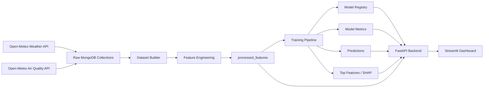

# Karachi AQI Predictor

A machine learning and MLOps project for forecasting Karachi's Air Quality Index (AQI). The system collects hourly weather and air-quality data, stores it in MongoDB Atlas, engineers time-series features, trains multiple forecasting models, exposes the results through a FastAPI backend, and visualizes them in a Streamlit dashboard.

## Live links

- Frontend: https://aqi-predictor-karachi.vercel.app
- Backend: https://aqi-predictor-karachi.onrender.com

The backend or frontend may take a few seconds to wake up if hosted on a free service.

## Key features

- Hourly data collection from Open-Meteo weather and air-quality APIs
- MongoDB Atlas used as the cloud data store, feature store, model registry, and monitoring store
- Feature engineering for AQI forecasting using lag features, rolling windows, pollutant ratios, meteorological signals, seasonal flags, and interaction features
- Forecast horizons for 24, 48, and 72 hours
- Multiple models: Random Forest, Ridge Regression, and XGBoost
- SHAP or coefficient-based feature importance for model explainability
- Prediction intervals using conformal calibration
- FastAPI backend for serving metrics, forecasts, AQI history, feature importance, and pipeline status
- Streamlit dashboard for current AQI, history, forecasts, model comparison, feature importance, and pipeline monitoring
- GitHub Actions workflows for automated hourly feature generation and daily model training

## Project architecture



## Repository structure

```text
AQI_PREDICTOR_KARACHI/
├── .github/
│   └── workflows/
│       ├── feature_pipeline.yml
│       └── training_pipeline.yml
├── dashboard/
│   ├── backend/
│   │   ├── main.py
│   │   └── requirements.txt
│   └── frontend/
│       ├── .streamlit/
│       │   └── secrets.toml
│       ├── app.py
│       └── requirements.txt
├── eda/
│   ├── eda.pipeline.py
│   └── fetch_ml_results.py
├── feature_pipeline/
│   ├── __init__.py
│   ├── build_dataset.py
│   ├── config.py
│   ├── feature_engineering.py
│   ├── feature_store.py
│   ├── fetch_air_quality.py
│   └── fetch_weather.py
├── train_pipeline/
│   ├── __init__.py
│   ├── evaluate.py
│   ├── load_data.py
│   └── train_pipeline.py
├── .gitignore
├── requirements.txt
├── run_feature_pipeline.py
└── run_training_pipeline.py
```

## Data pipeline

### 1. Weather data collection

`feature_pipeline/fetch_weather.py` pulls hourly Karachi weather data from the Open-Meteo Archive API and saves it to MongoDB.

Collected weather signals include:

- temperature
- relative humidity
- pressure
- wind speed
- wind direction
- wind gusts
- precipitation
- cloud cover
- dew point
- surface pressure

### 2. Air-quality data collection

`feature_pipeline/fetch_air_quality.py` pulls hourly pollutant data from the Open-Meteo Air Quality API and saves it to MongoDB.

Collected air-quality signals include:

- PM2.5
- PM10
- carbon monoxide
- nitrogen dioxide
- sulphur dioxide
- ozone
- dust
- UV index

### 3. Dataset building

`feature_pipeline/build_dataset.py` merges raw weather and air-quality collections into `karachi_aqi_dataset`.

The pipeline uses `datetime` as a unique key and performs MongoDB bulk upserts to avoid duplicate hourly records.

### 4. Feature engineering

`feature_pipeline/feature_engineering.py` creates the processed feature store used by the models.

Feature categories include:

- AQI lag chains
- PM2.5 and PM10 lag features
- rolling mean, standard deviation, max, min, and quantile features
- exponential moving averages
- pollutant change and rate-of-change features
- wind decomposition and sea-breeze proxy features
- monsoon and seasonal indicators
- pollutant ratios
- weather and pollutant interaction terms
- EPA-style AQI calculation from PM2.5

The engineered data is written to MongoDB collection `processed_features`.

## Training pipeline

`run_training_pipeline.py` is the main entry point for model training. It checks that `processed_features` exists, then runs the consolidated training pipeline from `train_pipeline/train_pipeline.py`.

The training pipeline supports these forecast horizons:

- 24 hours
- 48 hours
- 72 hours

The models trained are:

- Random Forest
- Ridge Regression
- XGBoost

The pipeline writes outputs to MongoDB collections such as:

- `model_registry`
- `model_metrics`
- `model_artifacts`
- `predictions_{model}_{horizon}h`
- `top_features`
- `pipeline_runs`
- `pipeline_status`

## Model evaluation

The training pipeline calculates and stores metrics such as:

- MAE
- RMSE
- MAPE
- R²
- explained variance
- conformal prediction interval coverage
- conformal average width
- event precision, recall, and F1 for high-AQI thresholds
- error by AQI band
- top-quantile error analysis
- forecast skill score versus persistence baseline

## Explainability

Feature importance is generated for model interpretability.

- Random Forest and XGBoost use SHAP where available.
- Ridge uses absolute coefficient strength.
- Top features are stored in MongoDB and exposed through the backend.

The dashboard reads this data from:

```text
/api/top-features/{model}/{horizon}
```

## Backend API

The FastAPI backend is located in:

```text
dashboard/backend/main.py
```

### Main endpoints

| Endpoint | Description |
|---|---|
| `/` | Health check |
| `/api/latest-aqi` | Latest AQI and pollutant readings |
| `/api/aqi-history?hours=168` | Recent AQI history |
| `/api/metrics` | Metrics for all models and horizons |
| `/api/metrics/{horizon}` | Metrics for one horizon |
| `/api/predictions/{model}/{horizon}?limit=336` | Prediction rows for a model and horizon |
| `/api/model-comparison` | Cross-model comparison table |
| `/api/top-features/{model}/{horizon}` | SHAP or feature importance data |
| `/api/pipeline-status?limit=30` | Recent feature and training pipeline statuses |

### Supported model keys

```text
random_forest
ridge
xgboost
```

### Supported horizons

```text
24
48
72
```

## Frontend dashboard

The Streamlit frontend is located in:

```text
dashboard/frontend/app.py
```

Dashboard tabs include:

- Overview
- Forecast
- Model Comparison
- Feature Importance
- Pipeline Status

The frontend uses the `BACKEND_URL` environment variable or Streamlit secret. If not provided, it falls back to:

```text
https://aqi-predictor-karachi.onrender.com
```

## Automation with GitHub Actions

### Feature pipeline

Workflow file:

```text
.github/workflows/feature_pipeline.yml
```

Schedule:

```text
0 * * * *
```

This runs the feature pipeline every hour and can also be triggered manually from GitHub Actions.

### Training pipeline

Workflow file:

```text
.github/workflows/training_pipeline.yml
```

Schedule:

```text
17 3 * * *
```

This runs the full model training pipeline daily and can also be triggered manually from GitHub Actions.

## Environment variables

Create a `.env` file locally or set these variables in your hosting platform or GitHub Secrets.

```env
MONGODB_URI=mongodb+srv://<user>:<password>@<cluster-url>/<database>
BACKEND_URL=https://aqi-predictor-karachi.onrender.com
```

| Variable | Required for | Purpose |
|---|---|---|
| `MONGODB_URI` | Feature pipeline, training pipeline, backend | Connects to MongoDB Atlas |
| `BACKEND_URL` | Frontend | Points Streamlit to the FastAPI backend |

## Local setup

### 1. Clone the repository

```bash
git clone https://github.com/hammaddahmeddd/AQI_PREDICTOR_KARACHI.git
cd AQI_PREDICTOR_KARACHI
```

### 2. Create and activate a virtual environment

```bash
python -m venv .venv
source .venv/bin/activate
```

For Windows PowerShell:

```powershell
python -m venv .venv
.venv\Scripts\Activate.ps1
```

### 3. Install root dependencies

```bash
pip install --upgrade pip
pip install -r requirements.txt
```

### 4. Set environment variables

```bash
export MONGODB_URI="mongodb+srv://<user>:<password>@<cluster-url>/<database>"
```

For Windows PowerShell:

```powershell
$env:MONGODB_URI="mongodb+srv://<user>:<password>@<cluster-url>/<database>"
```

## Running the pipelines locally

### Run the feature pipeline

```bash
python run_feature_pipeline.py
```

This will:

1. Fetch weather data
2. Fetch air-quality data
3. Merge raw collections into `karachi_aqi_dataset`
4. Build engineered features into `processed_features`

### Run the training pipeline

```bash
python run_training_pipeline.py
```

This will train and evaluate all configured models across all forecast horizons.

## Running the backend locally

```bash
cd dashboard/backend
pip install -r requirements.txt
uvicorn main:app --host 0.0.0.0 --port 8000
```

Open:

```text
http://localhost:8000
```

Example API call:

```text
http://localhost:8000/api/latest-aqi
```

## Running the frontend locally

Open a new terminal:

```bash
cd dashboard/frontend
pip install -r requirements.txt
export BACKEND_URL="http://localhost:8000"
streamlit run app.py
```

For Windows PowerShell:

```powershell
cd dashboard/frontend
pip install -r requirements.txt
$env:BACKEND_URL="http://localhost:8000"
streamlit run app.py
```

## Deployment notes

### Backend on Render

Use the backend folder as the service root or configure the build command from the repository root.

Recommended start command:

```bash
uvicorn main:app --host 0.0.0.0 --port $PORT
```

Required environment variable:

```text
MONGODB_URI
```

### Frontend on Streamlit hosting

Set the app path to:

```text
dashboard/frontend/app.py
```

Required secret or environment variable:

```text
BACKEND_URL
```

## Troubleshooting

### Backend returns `MONGODB_URI environment variable is not set`

Set `MONGODB_URI` in Render, GitHub Secrets, or your local environment.

### Training pipeline says `processed_features collection is empty`

Run the feature pipeline first:

```bash
python run_feature_pipeline.py
```

### Feature importance is not showing in the dashboard

Check the backend endpoint directly:

```text
/api/top-features/xgboost/24
```

If it returns data but the dashboard does not show the chart, check the frontend rendering order and make sure the chart is rendered before any large comparison section that may push it down the page.

### Backend is live but frontend cannot load data

Confirm the frontend `BACKEND_URL` points to the deployed backend URL and does not include a trailing slash.

### API returns no predictions

Run the training pipeline and confirm the prediction collections exist in MongoDB:

```text
predictions_random_forest_24h
predictions_ridge_24h
predictions_xgboost_24h
```

## Security notes

Do not commit real credentials or private tokens to the repository. Store secrets in GitHub Secrets, Render environment variables, Streamlit secrets, or a local `.env` file that is ignored by Git.

If `dashboard/frontend/.streamlit/secrets.toml` contains real values, remove it from the repository history and keep only an example file such as `secrets.toml.example`.

## Suggested future improvements

- Add a dedicated `README` section with screenshots of the dashboard
- Add unit tests for AQI calculation, feature engineering, and API response schemas
- Add CI checks for linting and import validation
- Add Dockerfiles for backend and frontend deployment
- Add a `.env.example` file
- Add API response examples for each backend route
- Add monitoring alerts for failed GitHub Actions workflow runs

## License

No license file is currently included. Add a license before distributing or reusing this project publicly.
